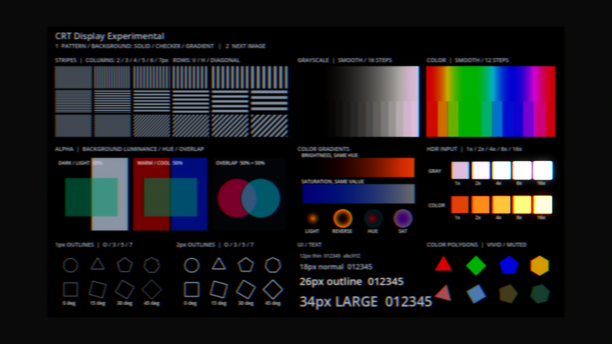

# CRT shadow mask設定の整理

実施日：2026-10-02（JST）。計測区間：02:54:51〜03:06:52。報告書保存前までの合計12分01秒。

| 工程 | 内容 | 未解決の問題 | 解決済みの問題 | 所要時間 |
| --- | --- | --- | --- | --- |
| 調査・実装 | 現在の保存Resourceとshaderを確認。配置方式への行ずらし統合、sampling削減、倍率統合、mainの保存値移行 | なし | 独立したStagger Rows、二重の明るさ倍率、Horizontal 2、Mixed Pixel Patternを除去 | 5分25秒 |
| 仕様更新・検証 | PARAMETERS / PHOSPHOR_CELLS更新、CLI構文確認、GPU比較36条件、Resourceとモデル切替の確認、CRT test画面比較 | HDR倍率統合の丸め差。旧Horizontal 2との見た目は一致しない | 残す配置とsamplingの動作、現在のCRT testの全pixel一致を確認 | 5分04秒 |
| 最終確認 | 削除項目の参照検索、Scene差分確認、実行ログ確認、開始時の停止状態へ復帰 | 別の旧Bloom test Sceneのscript参照欠落（既存、対象外） | 現在のCRT test再起動後のエラーなし。3件の初回検証エラーは旧Bloom test参照欠落と特定 | 1分32秒 |

## 実装

- Mask RedistributionとCell Emissionを維持。
- Mask PatternはStaggered RGB、Staggered RGB (Row Pairs)、RGB Pixel Pattern、Green / Magenta Stripes。
- 前二つは毎行／2行ごとに半triadずらす配置方式。両描画モデルで選択可能。共通geometry関数を使用し、Stagger Rowsのexportとuniformを削除。
- Row Pitchは1行の高さとして維持。Triad Pitch、Mask Strength、Horizontal / Vertical Gap、Gap Alignmentも維持。
- Cell Emissionへの切替で対応RGB配置は保持し、未対応の固定pixel配置だけStaggered RGBへ切り替える。
- Cell SamplingはHorizontal 4（ID 1）と2x2（ID 2）。初期値はHorizontal 4。Horizontal 2の経路を削除。
- Cell Brightnessを削除し、両モデルの混合後の明るさ倍率をBrightness Compensationに一本化。範囲0.25〜6は旧二項目の積の全範囲を保持する。
- Mixed Pixel Patternの4×4配置を削除。Green / Magenta StripesはG列とR+B列の配置を指す名前として保持。
- 日本語UI、独自Inspector property、内部比較modeや移行aliasは追加していない。

## 保存設定

mainのStagger Rows = 2をMask Pattern = 1へ移した。
現在のCRT testはCell / Staggered RGB / 2x2、pitch 2、row 3、Gap 0 / 0、Gap Alignment = Pixel Center、Mask Strength = 1、Noise無効。
testと共通PostProcessingのSceneは作業開始時と変更なし。mainも上記の移行以外は変更なしと全文比較で確認した。
保存ResourceにMixed、明示的なHorizontal 2、非初期値のCell Brightnessの使用はなかった。

外部に保存した旧Resourceは[移行表](../../presentation/post_processing/effects/crt_display_experimental/PHOSPHOR_CELLS.md)に沿って移行する。
Cell使用中の旧Cell BrightnessとBrightness Compensationは積を新Brightness Compensationへ保存する。
Horizontal 2から4への移行は横方向に変化する入力とapertureの積の近似を変更するため、同一出力ではない。

## 検証結果

Godot 4.7.2、同一Editor sessionで確認した。

- Godot CLIの変更GDScript check-only：成功。
- GPU比較：128×96 HDR SubViewport、HDR色勾配、鋭い色境界、行方向の明暗を入力。
- Redistribution 8条件：4配置 × Signal有無。全pixel一致。
- Cell 24条件：2配置 × 2sampling × Strength 0 / 0.5 / 1 × 2Gap Alignment。pitch 2.5 / 4、row 1 / 3、Gap 0.5 / 0.75。旧gain 0.7 × 1.2を新0.84と比較。最大相対差0.000965251（約0.0965%）、最大絶対差0.015625。全結果は有限値。倍率の乗算順序変更に伴うHDR保存精度の丸め差を含む。
- 現在のCRT test Cell設定1条件：全pixel一致。
- 意図したHorizontal 2→4の差3条件：pitch 2 / 2.5 / 4。急なHDR境界では最大絶対差約0.504 / 0.732 / 0.504。これは通常画面の平均差ではなく、差が最も大きいpixelの値。
- Resource確認：main、共通PostProcessing、CRT testのモデル・配置・sampling・倍率が意図どおり。
- 公開property：Stagger Rows、Cell Brightnessなし。Cellでも二つのRGB配置が選択可能。未対応配置とsampling ID 0をsetterが拒否。
- 両passへのPattern / 共通gain伝播、モデル切替時の対応配置保持を確認。
- 実際のCRT test全体：1515×852、変更前後のRGB差0、異なるpixel 0。Bloom Coreにも使われるMaterialを一時的に変更前shaderへ差し替えて比較し、その後復元。Noiseは保存設定で無効。
- 再起動後のCRT testのgame / editorログにエラーなし。
- git diff --check：成功（改行形式に関するGitの通知のみ）。

画像：[変更前](artifacts/crt-mask-parameter-simplification/crt-test-before.png)、[変更後](artifacts/crt-mask-parameter-simplification/crt-test-after.png)。

## 対象外の既存問題

保存Resourceの網羅確認でphosphor_bloom_test.tscnも読み込んだ際、参照先phosphor_bloom_test.gdが存在せず、3件の読込エラーが記録された。
このSceneのCRT Resourceは取得できたが、Scene全体の正常読込としては扱わない。今回変更したファイルとは別の欠落参照であり、修正していない。
実際のcrt_display_test.tscnの正常起動と画面比較は別のrunで確認済み。
小数pitchの色変動、局所HDR飽和、maskの粒感の美術調整も今回の整理では変更していない。

