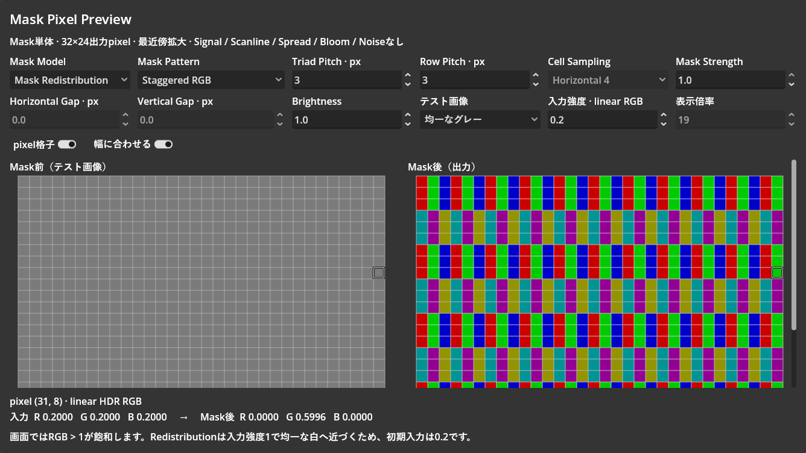

# Mask Pixel Previewの表示幅調整

実施日：2026-10-02（JST）。計測区間15:33:51〜15:44:30。合計10分39秒。

| 工程 | 内容 | 未解決の問題 | 解決済みの問題 | 所要時間 |
| --- | --- | --- | --- | --- |
| 調査・実装 | 入力の役割を確認。左右の領域を等幅化し、整数倍率の自動調整と手動切替を追加。テスト画像・Mask前・Mask後の表記を整理 | なし | 固定倍率の画像が左に集中し、右に大きな空白が残る配置を解消 | 4分07秒 |
| 検証・修正 | 両scriptのCLI check-only、Godot AIで実行画面・選択・倍率・幅変更を確認 | なし | 既存のint / float三項演算子警告を分岐へ修正。確認コードのtree宣言漏れによるデバッガ停止を、再起動と設定復元で復旧 | 6分32秒 |

## 変更

- 入力はMask前のテスト画像。均一グレーは配置確認、細線・境界は色の分離や混ざり方の確認に使う。名称とtooltipに説明を追加。
- 左右の表示領域は等幅で、画像はそれぞれの中央に配置。
- 「幅に合わせる」を初期ONとし、幅に収まる最大の整数倍率へ調整。最近傍拡大と32×24pxの実描画解像度を維持。
- 手動倍率は「幅に合わせる」をOFFにして4〜64倍で指定。縦方向が収まらない場合はスクロール。
- 整数倍率の端数とスクロールバーの幅に相当する小さな余白は残る。自動調整時にスクロールバーの出現で倍率が振動しないよう、その幅を予約する。
- CRT本体やshaderの描画式は変更していない。

## 検証

- Godot 4.7.2、Editor PID 28596の同一sessionで実施。
- `mask_preview.gd` / `mask_pixels.gd`のCLI check-onlyは終了コード0。
- 実行画面1336×752：左右とも幅636px、倍率19、画像幅608px、各画像の左余白14px。
- プレビューの幅を1208pxへ縮小すると左右572px、倍率17。元の幅へ戻すと倍率19に復帰。
- 自動調整OFFでは倍率12へ変更でき、左右の領域は等幅を維持。ONへ戻すと倍率19に復帰。
- 中央配置の余白を考慮したマウス位置からpixel (7, 5)を選択でき、両表示が同期。完了時は元の選択 (31, 8)へ復元。
- 幅変更前後のMask出力32×24pxのRGBは全pixel一致、最大差0。
- 実行中のModel=Redistribution、Pattern=Staggered RGB、Pitch=3、Row=3、Strength=1、Brightness=1、Gap=0、入力グレー0.2を復元。完了時はプレビュー実行中。
- 最終game / editorログに新規エラーなし。確認画像はlinear HDRをsRGBへ変換して保存し、目視確認。
- 作業開始前からあるCRT test Sceneの変更は維持。

