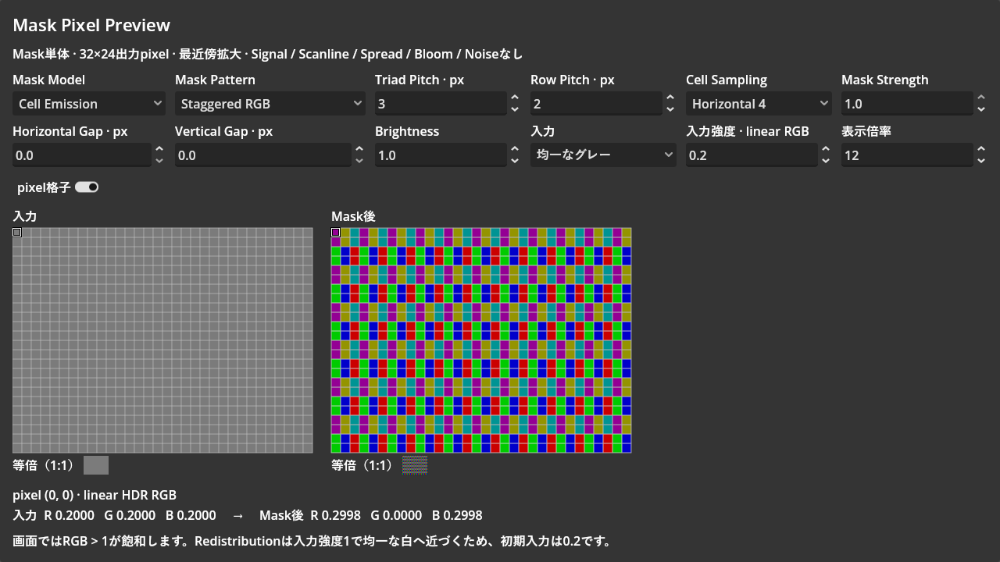

# Mask Pixel Preview

実施日：2026-10-02（JST）。計測区間15:02:33〜15:22:28。報告書保存前までの合計19分55秒。

| 工程 | 内容 | 未解決の問題 | 解決済みの問題 | 所要時間 |
| --- | --- | --- | --- | --- |
| 調査・実装 | 既存MaskのCore / Cellを直接使う32×24 HDRプレビュー、入力、操作UI、拡大格子、pixel選択を作成 | なし | 配置・Pitch・sampling・明るさの差をpixel単位で観察する手段を追加 | 6分39秒 |
| 実行検証・修正 | CLIとGodot AIで実行。HDR表示、保存設定の読み込み、Model / Pattern / Pitch、Mask無効化、細線とGapを確認 | なし | preloadされたscript型のローカル変数推論を明示型へ修正。UIを含むWindowをHDR化。非表示Windowで止まった出力を検証対象から除外し、表示中に再確認 | 9分13秒 |
| 仕上げ | ディスク上のCRT test Resourceを独立複製。等倍表示・矢印キー・格子・拡大倍率・表示scaleを整理。README、画像、数値結果を保存 | CLI起動時の既存OS証明書store読込エラー。全CRT効果を重ねた外観はこのSceneの対象外 | CLI構文・起動成功。Godot実行ログとeditorログに新規エラーなし。既存ファイルの変更なし | 4分03秒 |

## 使い方

[mask_preview.tscn](../../presentation/post_processing/test_scenes/mask_preview/mask_preview.tscn)をGodotで開き、F6で実行する。
作業完了時点では、元から実行中だったCRT testを止めず、別Windowにプレビューを開いた状態としている。
Windowを閉じるとプレビューだけを終了する。次回は上記Sceneから単独実行できる。

- 入力とMask後を同じ整数倍率で並べる。1マスが1出力pixel。
- Mask Model / Pattern、Triad Pitch 2〜6、Row Pitch 1〜4、Sampling、両Gap、Strength、Brightnessを変更できる。
- 非対応のPatternをCellに渡さず、作用しない項目は編集不可にする。
- 入力は均一グレー、縦境界、1px水平線／垂直線、RGB帯、グラデーション。
- 入力強度0〜2、拡大倍率4〜24、格子ON / OFFを調整できる。
- マウス位置を両画像で同期し、入力と出力のlinear HDR RGB値を表示する。クリック後は矢印キーでも選べる。
- 等倍表示も並べ、拡大した模様と通常のpixel密度を比較できる。

## 描画の範囲

Maskは別言語へ移植していない。CRTDisplayExperimental ResourceのCore / Cell shaderとparameter転送を直接使う。
初期値は起動時にディスク上のCRT test Sceneから独立複製して取得する。
現在の保存設定はCell / Staggered RGB、Pitch 3、Row 2、Horizontal 4、Gap 0 / 0、Strength 1。
プレビュー内の変更をCRT testや保存Sceneへ戻す処理はない。

SignalとScanlineは無効にし、Spread / Bloom / Noiseのpassは追加していない。
CellのCenter固定位相は本体と共通。Redistributionには本体の別の明るさ応答がそのまま現れる。
入力強度1ではRedistributionの均一グレーが模様を失うため、初期入力は0.2とした。
RGB > 1は通常表示で飽和するが、probeにはlinear HDR値を表示する。

SubViewportの32×24px解像度は拡大倍率を変えても固定。
両SubViewportと表示WindowにHDR 2Dを使用し、Windowのcontent scaleを無効にして最近傍拡大のpixel境界を保つ。
退出時にはそのWindowの元のscale modeへ戻す。
画像保存はHDRのlinear readbackをsRGBへ変換してからPNGへ保存した。

32px幅はPitch 3 / 5 / 6の整数周期ではない。
プレビュー領域の平均RGBは、画面全体の色バランスを保証する数値として扱わない。

## 検証

Godot 4.7.2、対象Editor PID 28596の同一sessionで検証した。

- CLI：両GDScript check-only成功。preview Sceneをheadlessで3frame起動して終了コード0。OS root certificate store読込エラーは既存の環境エラーとして切り分け、設定変更は行っていない。
- GPU：Redistributionの4配置、Cellの2配置 × Pitch 2〜6の30条件。各pixelのRGBが有限値であること、設定に応じて出力が変わることを確認。
- Strength 0：両Modelとも入力と全pixel一致、最大差0。
- 入力強度0.3：input probe約0.2998、Cellのpixel (0, 0)のR/B約0.4497を確認。入力変更、実描画、probeの更新が対応する。
- 1px水平線：Pitch 3 / Row 2 / Strength 1、入力0.2、暗部0.01。Horizontal 4の上下／中心のRGB行合計は約0.9595 / 19.1875 / 0.9595。2×2は約3.2383 / 14.6328 / 3.2383。縦方向の広がりの差が実際に出る。
- 最大Gap：両Gap 1、Row 1の出力も有限値。
- マウス位置からpixel (7, 5)を選び、両ビューが同期することを確認。右矢印で (8, 5)へ移動。
- 固定pixel配列ではPitch等の編集を無効化。Cellへの切替で対応Patternへ戻し、選択肢が2つになることを確認。
- 最終のGUI画像を目視確認。操作欄、格子、等倍表示、RGB値の表示を確認。
- 初回GPU検証はWindowを隠したためrender targetが更新されず、古い画像が返った。その結果は破棄し、Window表示中に同じ検証をやり直した。詳細は[検証結果](artifacts/crt-mask-preview/validation.json)に保存。
- 完了時のgame / editorログに新規エラーなし。元のCRT testは実行中のまま。git status上の変更は新規previewと報告用artifactのみ。

操作の説明は[README](../../presentation/post_processing/test_scenes/mask_preview/README.md)を参照。
実装時には[Godot Shader Language](https://docs.godotengine.org/en/stable/tutorials/shaders/shader_reference/shading_language.html)、[Viewport](https://docs.godotengine.org/en/stable/classes/class_viewport.html)、[Texture2D](https://docs.godotengine.org/en/stable/classes/class_texture2d.html)の公式APIを確認した。

