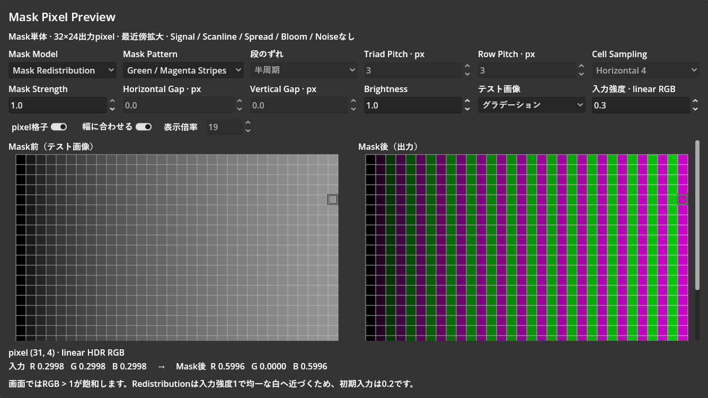

# RGB配置の段のずれ方式

実施日：2026-10-02（JST）。計測区間16:22:04〜16:31:23。報告書保存前までの合計9分19秒。

| 工程 | 内容 | 未解決の問題 | 解決済みの問題 | 所要時間 |
| --- | --- | --- | --- | --- |
| 調査 | project規則、共通RGB geometry、Resource、プレビュー、対象Editor sessionを確認 | なし | 段の切替間隔とずれ幅を独立させる変更箇所を特定 | 46秒 |
| 実装・基準取得 | 旧出力12条件を保存。Row Offset ModeをResource・両shader・プレビューへ追加。名称と説明を更新 | なし | None / Half Period / Integer Half Periodを同じgeometry関数で扱う。既存の保存IDと初期出力を維持 | 5分09秒 |
| 検証・仕上げ | CLI、GPU36条件、保存・読込、UI操作、画像確認、実行設定復元 | 整数版でも素子幅やCell固定位相に由来する混色は残る。仕様として維持 | 従来出力との全pixel一致、偶数Pitchでの一致、ずれなしでの配置一致を確認。検証用コードの型推論エラーによる停止を再起動で復旧し、取得済みの実行設定を復元 | 3分24秒 |

## 変更

- CRT ResourceのMaskグループに `Row Offset Mode` を追加。None（0）／Half Period（1）／Integer Half Period（2）。初期値は従来と同じHalf Period。
- ずれ幅は0／Pitch × 0.5／floor(Pitch × 0.5)。Pitch 3では0／1.5／1px、Pitch 6では0／3／3px。
- RGB Rows（旧Staggered RGB、ID 0）は毎段、RGB Row Pairs（旧Staggered RGB (Row Pairs)、ID 1）は2段ごとに位相を交互に切り替える。保存されたPattern IDは変更しない。
- Mask RedistributionとCell Emissionへ同じ設定を転送し、`rgb_aperture.gdshaderinc` でずれ幅を計算する。追加passやtexture samplingはない。
- RGB Pixel Pattern / Green / Magenta Stripesでは新しい項目を編集不可にする。設定値は保持し、RGBへ戻ると再使用できる。
- プレビューでは「段のずれ」としてMaskの操作欄へ配置。表示倍率はpixel格子・幅に合わせると同じ操作列へ移動し、設定欄は6列×2段を維持。
- Scene保存値、Gap、RGB素子幅、Cellの0.5px固定位相は変更していない。

## 検証

Godot 4.7.2、対象Editor PID 28596の同一sessionで実施。

- CLI：CRT ResourceとプレビューのGDScript check-onlyは終了コード0。
- GPU：両Model × 両RGB配置 × Pitch 3 / 4 / 6 × 3方式の36条件を描画。全RGB値が有限。
- Half Period：変更前の12条件のHDR画像と全pixel一致、最大RGB差0。
- 偶数Pitch 4 / 6：Half PeriodとInteger Half Periodの全pixelが一致、最大差0。
- None：RGB RowsとRGB Row Pairsの全pixelが一致、最大差0。
- Redistribution、入力均一グレー0.2、Strength 1、Pitch 3：半周期では768pixel中384pixelが複数色を含む。Noneと整数版では0pixel。
- Cell、同条件：半周期では384pixel、Noneと整数版では768pixelが複数色を含む。固定の0.5px位相を維持しているため、整数版はCMY除去機能ではない。
- プレビューの選択イベントで整数版を選び、CoreとCellのuniformがともに2になることを確認。
- Resourceを保存してCACHE_MODE_IGNOREで再読込し、整数版の値2を保持。
- 固定パターンではプレビューの項目がdisabled、ResourceのInspector propertyがREAD_ONLY。
- 左右の表示幅は636pxずつで、追加項目による右側の大きな空白は発生していない。
- 検証終了時はModel=Redistribution、Pattern=Green / Magenta Stripes、Pitch / Row=3、Brightness / Strength=1、Gap=0、入力グラデーション0.3、選択pixel (31, 4)、格子ON、自動倍率ONへ復元。新しい方式は初期値の半周期。
- 最終probeは入力RGB約0.2998、Mask後R / B約0.5996、G=0。検証中の一括変更後に残った古いprobe画像は再読込して更新。
- 起動・描画の新規エラーなし。検証コードで組み込み関数と同名の変数を使用した警告は記録されたが、実装ファイルには含まれない。
- 作業開始前からあるCRT test Sceneの変更は維持。

[数値結果](artifacts/crt-mask-row-offset/validation.json)と変更前のHDR画像は同じartifactディレクトリに保存。

## 制約

整数化するのは段のずれ幅のみ。RGBの幅が小数となるPitch、Gap、Cellの固定開始位相、Strengthの混合、後段のSpread / Bloomによる混色は別の原因として残る。
Noneでは段の切替間隔が見た目へ作用しなくなる。偶数Pitchでは半周期と整数版に差がない。

shader構文は[Godot Shader Language公式ドキュメント](https://docs.godotengine.org/en/stable/tutorials/shaders/shader_reference/shading_language.html)を確認した。
