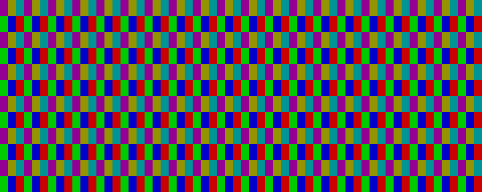
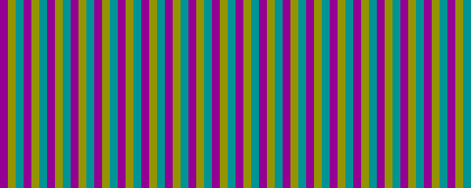
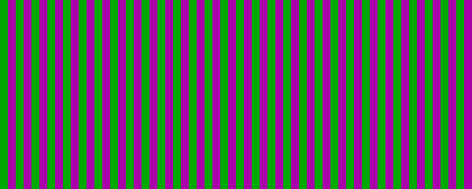

# CRT Maskの質感設定整理とPixel Preview削除

実施日: 2026-10-02。18:05:54 JST開始。Godot 4.7.2、現プロジェクトで検証。

## 結果

Maskは規則的な粒感と局所的な色・明るさの変化を担当する。
現在のCRT testの出力を維持し、Model / Pattern / Strength / Mask Pitch / Grain Heightの5項目に整理した。
Mask内に小グループは追加していない。

| 設定 | 役割 |
| --- | --- |
| Mask Model | Mask Redistribution / Cell Emission。前者は明るさに応じた色の再配分、後者はHDR信号とcoverageの積からの発光 |
| Mask Pattern | RGB Grain / RGB Stripes / Green / Magenta Stripes。全種類を両Modelで使用可能 |
| Mask Strength | 適用前と完全適用の混合比。0で無効 |
| Mask Pitch | 横一組の周期、2〜6出力px、整数step。旧Triad Pitchを改名 |
| Grain Height | RGB Grainの段の高さ、1〜8出力px、整数step。縦縞では読取専用 |

RGB Grainは段ごとに半周期ずれる従来の配置。RGB Stripesはずれなしの縦縞。
G/MはGとR+Bを交互に配置する。占有率はRGBが1/3、G/Mが1/2で、Cellでは3倍 / 2倍に正規化する。
RGBのCell横位相0.5pxは維持。G/Mは0pxとし、Pitch 2の模様がpixel内平均で消えることを避けた。
RGB GrainとRGB Stripesの境界coverageで複数channelが同じ出力pixelへ入ることは維持している。

Cell Samplingは横4点に固定。2x2、Horizontal / Vertical Gap、Row Offset Mode、Brightness Compensation、固定RGB/黒のPixel Patternは設定だけでなく実装も削除。
共通geometryを `mask_geometry.gdshaderinc` に集約し、旧名aliasやReference実装は追加していない。
Cell EmissionはStrength 0でpassとBackBufferCopyも無効化し、1で復帰する。

`test_scenes/mask_preview` のScene・Script・Shader・UID・READMEと空ディレクトリを削除した。
過去の作業報告は履歴として維持。今回の比較画像は報告用成果物で、プレビュー機能ではない。

## 保存値の移行

| Scene | 移行 |
| --- | --- |
| crt_display_test | Cell Emission / RGB Grain / Pitch 4 / Height 2 / Strength 1。ほかの効果と保存値は維持 |
| main | 旧RGB Row PairsのRow Pitch 3をGrain Height 6へ移し、2段groupingを高さへ集約。Pitch 4、Strength 0.8を維持 |
| post_processing | 旧G/Mの固定2px周期をPattern ID 2 / Pitch 2へ移行。Strength 1を維持 |

main / post_processingの旧SamplingとGapはRedistributionでは使われていなかった。
旧Row Pairsの `floor(floor(y / h) / 2)` は新Grainの `floor(y / (2h))` に相当する。
外部で別途保存したResourceは[移行表](../../presentation/post_processing/effects/crt_display_experimental/PHOSPHOR_CELLS.md)に従う必要がある。

## 検証

- Godot CLIのCRT Resource構文確認: 成功。
- 保存済み3 SceneのResource読込、Mask項目数、両Modelの全Pattern選択、Grain Heightの読取専用切替、Strengthによるpass有効状態: 成功。
- Godot AIで再起動後のEditor session `prototype@a37e29ab83064025`、PID 19964を使用。実行確認後は停止状態へ戻した。
- 現在のCRT testの1336×752出力: HDR RGBの生バイト列で変更前後が完全一致。最終変更後の再実行でも一致。[比較結果](artifacts/crt-mask-texture-cleanup/frame-comparison.json)、[pass確認](artifacts/crt-mask-texture-cleanup/pass-validation.json)。
- 60×24 HDRの色変化・1px線を含む入力で、両Model、Pitch 2〜6、Height 1〜4の40条件を比較。31条件は完全一致。残り9条件は最大0.0009765625の差。演算簡略化後の16bit float出力に微小差があり、全設定の完全一致を保証するものではない。現在のPitch 4 / Height 2は完全一致。[検証値](artifacts/crt-mask-texture-cleanup/after-validation.json)。
- 均一linear RGB 0.2を3 Pattern × 2 Modelで描画。各RGB平均は0.1998698〜0.1999512、G/Mも消えずに表示。Strength 0の入力との差は最大0.000048828125で、16bit floatへの格納誤差の範囲。
- Cell Strength 0でrect / BackBufferCopyの両方が非表示、Strength 1で復帰: 成功。
- 最終実行のEditorエラー・警告: 0件。`git diff --check`: 成功。実装範囲に旧設定と削除済みプレビューへの参照はない。
- 検証用Script・生バイト列・EXRは一時生成後に削除し、JSONとPNGのみ保存した。

変更前の設定は[before-settings.json](artifacts/crt-mask-texture-cleanup/before-settings.json)、保存Resourceの確認は[resources.json](artifacts/crt-mask-texture-cleanup/resources.json)。
変更前後の画像: [before](artifacts/crt-mask-texture-cleanup/before.png) / [after](artifacts/crt-mask-texture-cleanup/after.png)。

CellのPattern比較（均一入力、Grain / RGB StripesはPitch 3・Height 2、G/MはPitch 2。最近傍10倍）:

| RGB Grain | RGB Stripes | Green / Magenta Stripes |
| --- | --- | --- |
|  |  |  |

## 工程と所要時間

所要時間はツール待機・接続回復待機を含む経過時間。

| 工程 | 内容 | 未解決の問題 | 解決済みの問題 | 所要時間 |
| --- | --- | --- | --- | --- |
| 調査・変更前保存 | 既存Shader / Resource / 保存Sceneを確認、現設定とGPU出力を保存 | なし | 現設定がGap 0 / 横4点であることを確認。評価コードの誤ったviewport参照は訂正して再実行 | 8分26秒 |
| 実装 | 共通geometry、3 Pattern、5項目化、Scene移行、Pixel Preview削除 | なし | Sampling / Gap / offset / gainの不要分岐と旧配列を削除 | 4分34秒 |
| 接続回復・文書更新 | 対象Editorの終了を確認、ユーザーの再起動回答を受けて新sessionを特定、仕様書更新 | Editor終了の原因は特定していない | 再起動後の同じprojectで検証を再開 | 2分37秒 |
| 検証・成果物整理 | 全画面比較、40条件、全Pattern・Strength 0、保存Resourceと実行ログ確認、一時ファイル削除 | 一部の非既定周期の微小HDR差。既存のphosphor_bloom_test.tscnは参照Scriptがなく検証対象から除外。CLIではOS証明書ストア読込エラーも出た | 現在の見え方の完全一致、全Patternの描画、passの停止復帰。検証Scriptの変数名警告も修正 | 6分37秒 |
| 報告 | 比較結果と移行仕様を保存、差分を最終確認 | なし | 最終実行に新しいエラー・警告なし | 約1分 |

構文は[Godot Shading Language公式資料](https://docs.godotengine.org/en/stable/tutorials/shaders/shader_reference/shading_language.html)を参照。
