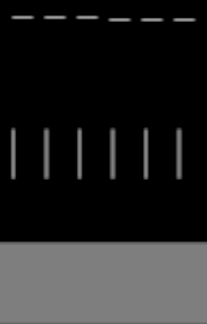

# CRTの縦補間と走査線の分離

実施日: 2026-10-01（JST）
対象: `presentation/post_processing/effects/crt_display_experimental/`
Godot 4.7.2 / Forward Plus / D3D12 / HDR 2D

## 実装内容

第2段階として、縦方向の信号再構成と、走査線の明るさの濃淡を分離した。
前段のPrefilterによる細線対策を使用し、柔らかさと横線の見え方をそれぞれ調整できる。

| 調整場所 | 設定 | 初期値 | 見た目と無効化 |
| --- | --- | --- | --- |
| Signal Reconstruction | Vertical Blur | 1 | 0で横方向だけの信号処理。1で縦の再構成を完全適用。中間値は両者の混合 |
| Scanline | Scanline Strength | 0.15 | 0で走査線の濃淡を無効化。上げると行方向の明暗が強くなる |
| Scanline | Beam Width | 0.9 lines | 走査線の発光profileの幅。縦の補間には影響しない。1では模様がほぼなくなる |

Signal Enabledは信号再構成を切り替える。OFFでもScanline Strengthの濃淡は使用できる。
Scanline Countは信号の行数と模様の周期で共用する。行数を変えると縦の柔らかさと模様の密度へ影響する。
maskのrow patternやSubstrateのVertical Gapは別の処理なので、Scanline Strength = 0でも残る。

今回の初期値では弱い行方向の濃淡を足す。
輪郭の柔らかさを大きく変えるにはVertical Blurを下げる。
既存の保存済みBeam Widthは優先されるが、現在は模様だけを調整する値になる。

## 処理

- 縦の補間は、隣接行を `lower = 0.5 - 0.5 * cos(π * phase)`、`upper = 1 - lower` で混合。
- 以前のBeam Width = 1と同じ補間形状を基準にして、補間からBeam Widthを取り除いた。
- Vertical Blur = 0は元の縦座標で横方向だけ再構成する。縦のPrefilterも使わない。
- Vertical Blurの中間値は横方向だけの画像と、縦も再構成した画像の混合。
- 走査線は従来のcosine-power profileと光量補正を使用し、補間後のRGBへ共通倍率を掛ける。
- profileを出力pixel内の縦4点で平均し、帯の輪郭を柔らかくする。
- 1出力pixelあたり0.4〜0.5行で模様を徐々に弱め、0.5行以上では無効にする。表示解像度で描き分けにくい周期によるaliasingを抑える。
- Strength = 0なら模様の計算を省略する。追加passや中間textureは使用しない。
- RGB / HDRをclampしない。BloomのCore再描画にも同じMaterialの設定が反映される。

## 変更ファイル

- `crt_display_experimental.gd`: 2つの調整値、変更通知、Shader反映、Inspectorのグループを追加・整理。
- `crt_display_experimental.gdshader`: 縦の再構成と走査線の濃淡を分離。
- `PARAMETERS.md`: 調整方法、初期値、共用する密度、負荷を記載。
- `crt_display_test.tscn`: `signal_prefilter_enabled = null` の不正なbool保存値を削除し、初期値trueを使用するよう修正。

テストシーンの現在のmask調整は保持した。
RuntimeでPrefilter = true、mask = VGA Phosphor、Triad Pitch = 2、Row Pitch = 1を確認。

## 検証

### 機械的検証と起動

```powershell
& 'C:/GameDev/Tools/Godot/godot.cmd' --headless --path 'C:/GameDev/Projects/prototype' --check-only --script 'presentation/post_processing/effects/crt_display_experimental/crt_display_experimental.gd'
git diff --check
```

両方成功。Godot AIでCRT testを起動し、実描画を確認した。
今回のGame / Editorの追加エラーはなかった。

### 分離と細線

独立した256×1080のHDR SubViewportで、maskを無効にしてsignal単独を比較。
Scanline Count = 360、Signal Pitch = 2、Sharpness = 0.5、Prefilter ON。
黒地の1px白線を6位置へずらして描画した。

| 確認項目 | 結果 |
| --- | --- |
| Scanline Strength = 0、Beam Width 0.9 → 1.25 | 検証画素の最大差0。模様の幅が縦補間へ影響しない |
| 実装前のBeam Width = 1と、今回のVertical Blur = 1 / Strength = 0 | linear greenの最大差約0.00098。演算順序・HDRの量子化による小差 |
| 横向き1px線の断面の明るさ合計、Vertical Blur 0 / 0.5 / 1 | いずれも約0.999〜1.000。元画像の合計は1 |
| 同じ線のピーク、Vertical Blur 0 / 0.5 / 1 | 1.0 / 約0.625〜0.667 / 約0.333。柔らかさを独立して調整できる |
| 初期値の走査線 | 均一灰色のlinear greenが約0.2106〜0.2144の弱い濃淡 |
| Strength = 1、Beam Width = 0.75 | 同じ灰色が約0.1855〜0.2642。強さを上げると明確に横線が出る |
| Signal Enabled = OFF、Strength = 1 | 信号再構成を無効にしても走査線の濃淡を使用できる |
| HDRと画面左右の端 | 1を超えるRGBを維持。NaN / Infなし |

比較画像の上段は横向き1px、中央は縦向き1px、下段は均一灰色。

Strength = 0:



初期値:


Strength = 1 / Beam Width = 0.75:


### 解像度とaliasing

高さ720 / 852 / 1080 / 2160、行数180 / 360 / 720、Beam Width 0.75 / 1 / 1.25を組み合わせ、均一なHDR色で確認。
1pixelあたり0.5行以上の条件では模様による濃淡がなく、RGB=(4, 2, 0.5)のRは全画素4を維持した。
表示できる周期では、走査線を強くしても平均Rは約3.996〜4.009。従来の光量補正近似と描画時の量子化により微差がある。
RGBへ共通倍率を掛けていることも検証でき、検証条件のR:B比は維持された。

### 実画像と負荷

現在のCRT testの第1画像と保存Effectを複製し、1920×1080のHDR SubViewportで比較。
Color Grading、Chromatic Aberration、VGA Phosphor / Integrated、Bloomを含む。

- [走査線0の画像](crt-scanline-separation-images/image-off.png)
- [初期値の画像](crt-scanline-separation-images/image-default.png)
- [Vertical Blur = 0の部分拡大](crt-scanline-separation-images/detail-vertical_off.png)
- [Vertical Blur = 0.5の部分拡大](crt-scanline-separation-images/detail-vertical_half.png)
- [Vertical Blur = 1の部分拡大](crt-scanline-separation-images/detail-default.png)

初期値の横線は控えめ。Vertical Blurを下げると髪・目などの細部が明瞭になる。
周期maskを含む画像のプレビューでは縮小によりモアレが生じるため、走査線の判断は単独の灰色テストも併用する。

各構成の全7 ViewportのGPU時間を合計。12フレーム待機後、12フレームを平均した。

| 構成 | GPU時間 |
| --- | --- |
| Vertical Blur = 1 / Strength = 0 | 約2.17 ms |
| Vertical Blur = 1 / Strength = 0.15 | 約1.92 ms |
| Vertical Blur = 0 / Strength = 0.15 | 約1.85 ms |
| Vertical Blur = 0.5 / Strength = 0.15 | 約2.45 ms |

同時描画・短時間測定のばらつきを含む。この結果からStrengthを上げると速くなるとは判断しない。
前段の報告とは保存mask設定が異なる。
Vertical Blurの中間値は両方のsignalを読むため追加負荷がある。0 / 1では必要な経路だけを描画する。

実行中のResourceをVertical Blur = 0、Strength = 0.6へ変更し、Materialへ反映されることを確認。
検証用Viewportはすべて破棄し、元のテストシーンの画像選択とRuntime設定は変更しなかった。

数値: [verification.json](crt-scanline-separation-images/verification.json)

## 工程・所要時間

時刻はUTC。

| 工程 | 内容 | 未解決の問題 | 解決済みの問題 | 所要時間 |
| --- | --- | --- | --- | --- |
| 確認・方式選択 | 既存Shader・設定・規則、Godot AI接続、公式仕様を確認 | 最終的な柔らかさと濃淡は調整対象 | 補間と明暗の分離方式を決定 | 5分2秒 |
| 実装 | Vertical Blur、Strength、profile平均、解像度対応、設定説明、null修正 | 中間値のsignal読み取り負荷 | 0による個別無効化、保存Prefilter値を修正 | 2分4秒 |
| 検証 | CLI、実描画、細線、分離、HDR、解像度、実画像、Runtime変更、GPU時間 | GPU時間は短時間測定のばらつきを含む | 細線を維持しながら柔らかさと模様を調整できることを確認 | 6分53秒 |
| 報告 | 比較画像と数値、調整方法、作業報告を保存 | 後続のノイズなどは次段階 | 今回の見た目の変化を個別比較できる資料を保存 | 2分40秒 |

開始: 2026-10-01 10:45:24 UTC。
報告時点: 2026-10-01 11:02:03 UTC。
合計: 16分39秒。

参照: [Godot Shader Language](https://docs.godotengine.org/en/stable/tutorials/shaders/shader_reference/shading_language.html)
