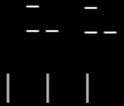
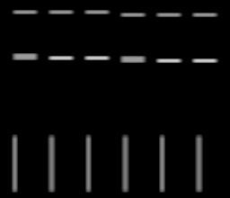

# CRT signalの細線対策

対象: `presentation/post_processing/test_scenes/crt_display_test/crt_display_test.tscn`
実施日: 2026-10-01（JST）
Godot: 4.7.2、Forward Plus / D3D12、HDR 2D

## 今回のまとまり

第1段階として、signalのサンプリングで細線を拾えなくなる問題を改善した。
好みのボケを完全に固定するより、位置によって線の明るさが変わりにくい方式を優先する。

横のSignal Pitchと縦のScanline Countで決まる各サンプルの担当範囲を、元画像のpixelとの重なりに応じて平均してから既存の補間へ渡す。
ONでは細かな輪郭が少し柔らかくなるが、サンプル間の線を拾える。
輪郭強調は追加していない。ボケによって線が広がり、ピークの明るさが下がることは残る。

## 調整

CRT Resource → **Signal Reconstruction → Signal Prefilter Enabled**

- 初期値ON。
- OFFで従来の点サンプリングと比較できる。
- Signal EnabledがOFFの場合、Prefilterも適用されない。
- 実行中のResource変更でShaderMaterialへ反映される。
- Cell側のSignal Samplingは別の設定であり、今回追加したPrefilterとは異なる。

Sceneの調整値は書き換えず、Resource / Shaderの初期値ONを使用する。
今回の変更はsignalの読み取り改善まで。縦補間と走査線の分離、ノイズ、mask再設計、色差のにじみ、周辺のボケと明るさは次の実装段階。

## 実装

- `crt_display_experimental.gd`: boolをexportし、変更通知とShader parameterへの反映を追加。
- `crt_display_experimental.gdshader`: rectangular pixel coverageによるPrefilterを追加。
- `PARAMETERS.md`: 設定、範囲、負荷、見た目の意味を追記。

横の平均範囲は `max(1, Signal Pitch)` 出力px。
縦は `max(1, Viewport高さ / Scanline Count)` 出力px。
隣接pixelの重みをbilinear samplingへまとめ、2×2 pixelを最大1回のtexture readで取得する。
重み0の再構成サンプルは読み取らない。
追加描画passは使わず、HDRのRGBをclampしない。画面外は端のpixelを延長する。
BloomのCore再描画も同じShaderMaterialを使用するため、同じ設定が適用される。

## 検証

機械的検証:

```powershell
& 'C:/GameDev/Tools/Godot/godot.cmd' --headless --path 'C:/GameDev/Projects/prototype' --check-only --script 'presentation/post_processing/effects/crt_display_experimental/crt_display_experimental.gd'
git diff --check
```

両方成功。Godot AIでCRT testを起動し、Shaderを実際に描画した。
今回の実行によるGame / Editorの追加エラーはなかった。

### 細線と明るさ

独立したHDR SubViewportで、1pxの白線を黒地に描き、位置を1pxずつずらした6条件を比較。
mask strengthを0、beam widthを1にし、他の効果を除いてsignal単独を測定した。
表の値は線に垂直な断面のlinear greenを合計したもの。元画像は1。

1080px高さ / 360 lines / Signal Pitch 2 / Sharpness 0.5:

| 対象 | 従来 / Prefilter OFF | Prefilter ON |
| --- | --- | --- |
| 横向き1px線、6位置 | 0, 2.999, 0, 0, 2.999, 0 | 各位置で約1.000 |
| 縦向き1px線、6位置 | 2, 0, 2, 0, 2, 0 | 各位置で約0.998〜1.002 |
| 均一灰色 | 0.211914 | 0.211914 |
| 実装前Shaderと新ShaderのOFF比較 | 最大差0 | — |

以下の条件も検証した。括弧内は高さ / lines / pitch / sharpness。

- 720 / 720 / 0.5 / 1.0
- 720 / 360 / 3 / 0.5
- 852 / 360 / 2 / 0.5
- 1080 / 180 / 3 / 0.67
- 1080 / 720 / 1 / 0.67
- 2160 / 180 / 3 / 0.5

ONではすべての位置で線を拾い、断面の合計は元画像の約0.995〜1.004に収まった。
RGB=(4, 2, 0.5)の均一HDR領域を画面左右の端で確認し、1を超える値を維持した。
検証画素にNaN / Infはなかった。
線幅・明るさを完全に保持する保証ではなく、今回の設定とパターンに対する結果。

比較: 各画像の上段は横向き1px、中段は2px、下段は縦向き1px。6本の位置を少しずつ変えている。

従来 / OFF:



ON:



### 実画像と描画負荷

現在のCRT testの第1画像と保存済みEffect設定を複製し、1920×1080の独立SubViewportでOFF / ONを比較。
Color Grading、Chromatic Aberration、mask、Bloomを含む。
細かな輪郭が少し柔らかくなり、細線の欠け方や濃さの偏りが減る方向の変化を確認した。
周期maskを含む画像はプレビュー縮小時にモアレが生じるため、maskの差の評価には使用しない。

- [OFFの画像](crt-signal-prefilter-images/image-off.png)
- [ONの画像](crt-signal-prefilter-images/image-on.png)

RenderingServerのGPU描画時間を各構成の全7 Viewportで合計。
12フレーム待ってから12フレームを平均した。

| 構成 | GPU描画時間 |
| --- | --- |
| Prefilter OFF | 約1.16 ms |
| Prefilter ON | 約2.79 ms |

この環境の同時比較時の数値で、単独起動時のFPSや他のGPUの性能を保証する値ではない。
読み取り数が増えるため負荷は増加する。低いScanline Countと高解像度を組み合わせるほど縦の範囲も広くなる。
必要ならOFFで従来の負荷へ戻せる。
この段階では、passや中間textureを増やさずに面積平均を実装する方式を採用した。
負荷をさらに下げる設計は、実際の対象解像度・GPUと見た目が定まった段階で判断する。

実行中のResourceでOFF→ONを切り替え、CoreのShader parameterがtrueへ更新されることを確認。
検証用Viewportはすべて破棄した。元のテストシーンの画像選択やEffect設定は検証中に変更していない。

測定値: [verification.json](crt-signal-prefilter-images/verification.json)

## 工程と所要時間

時刻はUTC。実装作業としての記録。

| 工程 | 内容 | 未解決の問題 | 解決済みの問題 | 所要時間 |
| --- | --- | --- | --- | --- |
| 確認・方式選択 | 既存Shader、Resource、設定、Godot AI接続、公式仕様を確認 | ボケの最終的な好みは継続調整 | 画素を拾わない原因と担当範囲を特定 | 2分23秒 |
| 実装 | 面積平均とON/OFF、parameter反映、説明を追加 | — | 横・縦の細線をサンプル範囲から拾う方式を実装 | 1分26秒 |
| 検証 | CLI、実描画、位置比較、HDR、画面端、実画像、GPU時間、設定変更を確認 | 描画負荷の増加。輪郭の柔らかさは好みの調整対象 | 従来の線消失、位置による大きな明るさの差を検証範囲で改善 | 8分50秒 |
| 報告 | 比較画像・数値・この作業報告を保存 | 後続段階は未実装 | 今回の変更原因を単独で確認できる資料を保存 | 1分56秒 |

開始: 2026-10-01 10:28:30 UTC。
報告時点: 2026-10-01 10:43:05 UTC。
合計: 14分35秒。

参照:
- [Godot Shader Language](https://docs.godotengine.org/en/stable/tutorials/shaders/shader_reference/shading_language.html)
- [Texture Sampling and Antialiasing](https://pbr-book.org/4ed/Textures_and_Materials/Texture_Sampling_and_Antialiasing)
- [RenderingServer GPU描画時間](https://docs.godotengine.org/en/stable/classes/class_renderingserver.html#class-renderingserver-method-viewport-get-measured-render-time-gpu)
